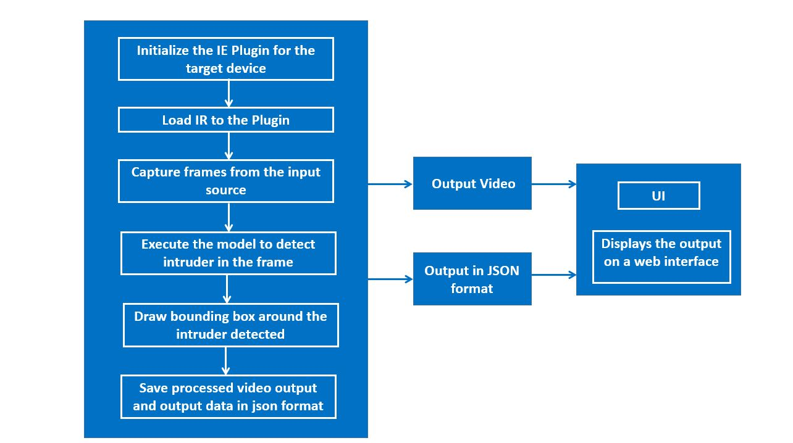

# DISCONTINUATION OF PROJECT #
This project will no longer be maintained by Intel.
Intel has ceased development and contributions including, but not limited to, maintenance, bug fixes, new releases, or updates, to this project.
Intel no longer accepts patches to this project.
# Intruder Detector

| Details           |          |
|-----------------------|-----------|
| Target OS:            |  Ubuntu\* 18.04  |
| Programming Language: |  C++      |
| Time to Complete:    |  50-70min |

This reference implementation is also [available in Python*](https://github.com/intel-iot-devkit/reference-implementation-private/blob/master/intruder-detector-python/README.md)


## What it Does
This reference implementation detect the objects in a designated area. It gives the number of objects in the frame, total count and also record the alerts of the objects present in the frame. The application is capable of processing the inputs from multiple cameras and video files.

## Requirements
### Hardware
* 6th to 8th Generation Intel® Core™ processors with Intel® Iris® Pro graphics or Intel® HD Graphics

### Software
* [Ubuntu\* 18.04 LTS](http://releases.ubuntu.com/18.04/)<br>
   **Note**: Use kernel versions 4.14+ with this software.<br> 
    Determine the kernel version with the uname command. 
    ```
    uname -a
    ```
* OpenCL™ Runtime Package
* Intel® Distribution of OpenVINO™ toolkit 2020 R3 Release

## How it Works
The application uses the Inference Engine included in the Intel® Distribution of OpenVINO™ toolkit. A trained neural network detects objects within a designated area by displaying a green bounding box over them, and registers them in a logging system.



## Setup

### Get the code
Clone the reference implementation
 ```
 sudo apt install git
 git clone https://github.com/intel-iot-devkit/intruder-detector-cpp.git
 ```

### Install OpenVINO
Refer to [Install Intel® Distribution of OpenVINO™ toolkit for Linux*](https://software.intel.com/en-us/articles/OpenVINO-Install-Linux) on how to install and setup the Intel® Distribution of OpenVINO™ toolkit.

You will need the OpenCL™ Runtime Package if you plan to run inference on the GPU as shown by the instructions below. It is not mandatory for CPU inference.

### Other dependencies
**FFmpeg***<br>
FFmpeg is a free and open-source project capable of recording, converting and streaming digital audio and video in various formats. It can be used to do most of our multimedia tasks quickly and easily say, audio compression, audio/video format conversion, extract images from a video and a lot more.


### Which Models to Use

This application uses the **[person-vehicle-bike-detection-crossroad-0078](https://docs.openvinotoolkit.org/latest/omz_models_intel_person_vehicle_bike_detection_crossroad_0078_description_person_vehicle_bike_detection_crossroad_0078.html)** Intel® model, that can be downloaded using the **model downloader**. The **model downloader** downloads the __.xml__ and __.bin__ files that is used by the application.

The application also works with any object-detection model, provided it has the same input and output format of the SSD model.
The model can be any object detection model:
- Downloaded using the **model downloader**, provided by Intel® Distribution of OpenVINO™ toolkit.

- Built by the user.<br>

To download the models and install the dependencies of the application, run the below command in the `intruder-detector-cpp` directory:
```
./setup.sh
```


### The labels file
In order to work, this application requires a _labels_ file associated with the model being used for detection.  
All detection models work with integer labels and not string labels (e.g. for the **person-vehicle-bike-detection-crossroad-0078** model, the number 1 represents the class "person"), that is why each model must have a _labels_ file, which associates an integer (the label the algorithm detects) with a string (denoting the human-readable label).   


The _labels_ file is a text file containing all the classes/labels that the model can recognize, in the order that it was trained to recognize them (one class per line).
For the **person-vehicle-bike-detection-crossroad-0078** model, we provide the class file _labels.txt_ in the resources folder.


### The config file
The _resources/config.json_ contains the path to the videos that will be used by the application and the labels to be detected on those videos. All labels defined will be detected on all videos.
The _config.json_ file is of the form `video: ["<path/to/video>"]` and `label: ["<labels>"]`. The labels used in the _config.json_ file must coincide with the labels from the _labels_ file.

Example of the _config.json_ file:
```
{

    "inputs": [
	    {— 
            "video": ["sample-videos/video1.mp4", "sample-videos/video2.mp4"],
            "label": [ "person", "bicycle", "car"]
        }
    ]
}
```

The application can use any number of videos for detection, but the more videos the application uses in parallel, the more the frame rate of each video scales down. This can be solved by adding more computation power to the machine the application is running on.


### What input video to use
The application works with any input video.
Sample videos for object detection are provided [here](https://github.com/intel-iot-devkit/sample-videos/).  


For first-use, we recommend using the [person-bicycle-car-detection]( https://github.com/intel-iot-devkit/sample-videos/blob/master/person-bicycle-car-detection.mp4) video.   
For example:
```
{

    "inputs": [
	    {
            "video": ["sample-videos/person-bicycle-car-detection.mp4"],
            "label": [ "person", "bicycle", "car"]
        }
    ]
}
```


### Using the camera stream instead of the video file
Replace `path/to/video` with the camera ID in the config.json file, where the ID is taken from the video device (the number X in /dev/videoX).

On Ubuntu, to list all available video devices use the following command:

```
ls /dev/video*
```

For example, if the output of above command is __/dev/video0__, then config.json would be:

```
{
    "inputs": [
	    {
            "video": "0",
            "label": [ "person", "bicycle", "car"]
        }
    ]
}
```

### Setup the Environment

Configure the environment to use the Intel® Distribution of OpenVINO™ toolkit by exporting environment variables:
```
source /opt/intel/openvino/bin/setupvars.sh
```
### Build the Application

To build, go to `intruder-detector-cpp` directory and run the following commands:

```
mkdir -p build && cd build
cmake ..
make 
```


## Run the application

If not in build folder, go there by using:

```
cd <path-to-intruder-detector-cpp>/build/
```

To see a list of the various options:

```
./intruder-detector -h
```

<!-- To run the application with the needed models:

```
./intruder-detector -d CPU -l ../resources/labels.txt -m /opt/intel/openvino/deployment_tools/tools/model_downloader/Security/object_detection/crossroad/0078/dldt/person-vehicle-bike-detection-crossroad-0078.xml
``` -->

<!-- ## Running on different hardware -->
A user can specify what target device to run on by using the device command-line argument `-d` followed by one of the values `CPU`, `GPU`, `MYRIAD`, `HETERO:FPGA,CPU` or `HDDL`. To run with multiple devices use _-d MULTI:device1,device2_. For example: _-d MULTI:CPU,GPU,MYRIAD_

### Running on the CPU
Although the application runs on the CPU by default, this can also be explicitly specified through the `-d CPU` command-line argument:
```
./intruder-detector -d CPU -l ../resources/labels.txt -m /opt/intel/openvino/deployment_tools/open_model_zoo/tools/downloader/intel/person-vehicle-bike-detection-crossroad-0078/FP32/person-vehicle-bike-detection-crossroad-0078.xml
```
**Note:** By default, the application runs on async mode. To run the application on sync mode, use `-f sync` as command-line argument.

### Running on the integrated GPU
- To run on the integrated Intel® GPU with floating point precision 32 (FP32) model, use the `-d GPU` command-line argument:
    ```
    ./intruder-detector -d GPU -l ../resources/labels.txt -m /opt/intel/openvino/deployment_tools/open_model_zoo/tools/downloader/intel/person-vehicle-bike-detection-crossroad-0078/FP32/person-vehicle-bike-detection-crossroad-0078.xml
    ```
    **FP32**: FP32 is single-precision floating-point arithmetic uses 32 bits to represent numbers. 8 bits for the magnitude and 23 bits for the precision. For more information, [click here](https://en.wikipedia.org/wiki/Single-precision_floating-point_format)<br>

- To run on the integrated Intel® GPU with floating point precision 16 (FP16):
    ```
    ./intruder-detector -d GPU -l ../resources/labels.txt -m /opt/intel/openvino/deployment_tools/open_model_zoo/tools/downloader/intel/person-vehicle-bike-detection-crossroad-0078/FP16/person-vehicle-bike-detection-crossroad-0078.xml
    ```
    **FP16**: FP16 is half-precision floating-point arithmetic uses 16 bits. 5 bits for the magnitude and 10 bits for the precision. For more information, [click here](https://en.wikipedia.org/wiki/Half-precision_floating-point_format)

### Running on the Intel® Neural Compute Stick
To run on the Intel® Neural Compute Stick, use the `-d MYRIAD` command-line argument:
```
./intruder-detector -d MYRIAD -l ../resources/labels.txt -m /opt/intel/openvino/deployment_tools/open_model_zoo/tools/downloader/intel/person-vehicle-bike-detection-crossroad-0078/FP16/person-vehicle-bike-detection-crossroad-0078.xml
```
**Note:** The Intel® Neural Compute Stick can only run on FP16 models. The model that is passed to the application, through the `-m <path_to_model>` command-line argument, must be of data type FP16.

### Running on the HDDL
To run on the HDDL, use the `-d HDDL ` command-line argument:
```
./intruder-detector -d HDDL -l ../resources/labels.txt -m /opt/intel/openvino/deployment_tools/open_model_zoo/tools/downloader/intel/person-vehicle-bike-detection-crossroad-0078/FP16/person-vehicle-bike-detection-crossroad-0078.xml
```
**Note:** The HDDL-R can only run on FP16 models. The model that is passed to the application, through the `-m <path_to_model>` command-line argument, must be of data type FP16.

<!--
#### Run on the Intel® Arria® 10 FPGA

Before running the application on the FPGA, set the environment variables and  program the AOCX (bitstream) file.<br>

Set the Board Environment Variable to the proper directory:

```
export AOCL_BOARD_PACKAGE_ROOT=/opt/intel/openvino/bitstreams/a10_vision_design_sg<#>_bitstreams/BSP/a10_1150_sg<#>
```
**NOTE**: If you do not know which version of the board you have, please refer to the product label on the fan cover side or by the product SKU: Mustang-F100-A10-R10 => SG1; Mustang-F100-A10E-R10 => SG2 <br>

Set the Board Environment Variable to the proper directory: 
```
export QUARTUS_ROOTDIR=/home/<user>/intelFPGA/18.1/qprogrammer
```
Set the remaining environment variables:
```
export PATH=$PATH:/opt/altera/aocl-pro-rte/aclrte-linux64/bin:/opt/altera/aocl-pro-rte/aclrte-linux64/host/linux64/bin:/home/<user>/intelFPGA/18.1/qprogrammer/bin
export INTELFPGAOCLSDKROOT=/opt/altera/aocl-pro-rte/aclrte-linux64
export LD_LIBRARY_PATH=$LD_LIBRARY_PATH:$AOCL_BOARD_PACKAGE_ROOT/linux64/lib
export CL_CONTEXT_COMPILER_MODE_INTELFPGA=3
source /opt/altera/aocl-pro-rte/aclrte-linux64/init_opencl.sh
```
**NOTE**: It is recommended to create your own script for your system to aid in setting up these environment variables. It will be run each time you need a new terminal or restart your system. 

The bitstreams for HDDL-F can be found under the `/opt/intel/openvino/bitstreams/a10_vision_design_sg<#>_bitstreams/` directory.<br><br>To program the bitstream use the below command:<br>
```
aocl program acl0 /opt/intel/openvino/bitstreams/a10_vision_design_sg<#>_bitstreams/2019R3_PV_PL1_FP11_RMNet.aocx
```

For more information on programming the bitstreams, please refer to [OpenVINO-Install-Linux-FPGA](https://software.intel.com/en-us/articles/OpenVINO-Install-Linux-FPGA#inpage-nav-11).

To run the application on the FPGA with floating point precision 16 (FP16), use the `-d HETERO:FPGA,CPU` command-line argument:
```
./intruder-detector -l ../resources/labels.txt -m /opt/intel/openvino/deployment_tools/open_model_zoo/tools/downloader/intel/person-vehicle-bike-detection-crossroad-0078/FP16/person-vehicle-bike-detection-crossroad-0078.xml -d HETERO:FPGA,CPU
```
-->

### Loop the input video 
By default, the application reads the input videos only once, and ends when the videos end.
In order to not have the sample videos end, thereby ending the application, the option to continuously loop the videos is provided.    
This is done by running the application with the `-lp true` command-line argument:

```
./intruder-detector -lp true -d CPU -l ../resources/labels.txt -m /opt/intel/openvino/deployment_tools/open_model_zoo/tools/downloader/intel/person-vehicle-bike-detection-crossroad-0078/FP32/person-vehicle-bike-detection-crossroad-0078.xml
```

This looping does not affect live camera streams, as camera video streams are continuous and do not end.


## Using the browser UI
To run the application in the browser UI, use `-ui true` command-line argument:
```
./intruder-detector -d CPU -l ../resources/labels.txt -m /opt/intel/openvino/deployment_tools/open_model_zoo/tools/downloader/intel/person-vehicle-bike-detection-crossroad-0078/FP32/person-vehicle-bike-detection-crossroad-0078.xml -ui true
```
The default application uses a simple user interface created with OpenCV.
A web based UI with more features is also provided [here](./UI).
